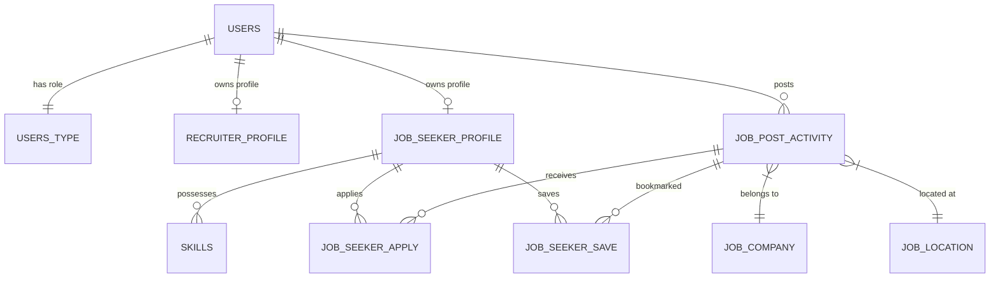

# 🚀 TalentTrack - Modern Job Portal Platform


**TalentTrack** is an enterprise-grade full-stack Job Portal web application built with **Spring Boot 3.3**, **Java 21**, **Spring Security 6**, **Spring Data JPA**, and **Thymeleaf**. It provides a seamless, dynamic platform bridging **Recruiters** and **Job Seekers** with real-time job searching, role-based dashboards, candidate application tracking, and profile/resume management.

🌐 **Live Application URL**: [https://talentrack.up.railway.app](https://talentrack.up.railway.app)

---

## 📸 Screenshots & UI Showcase

| 🏠 Home Page & Landing View | 🔍 Global Job Search & Filters |
| :---: | :---: |
|  |  |

| 🔐 User Authentication & Access Control | 📊 Candidate & Recruiter Dashboards |
| :---: | :---: |
|  |  |

---

## ✨ Key Features & Capabilities

### 🏢 For Recruiters
* **Job Posting & Management**: Post new job listings with rich text job descriptions, location details, salary ranges, and remote work options.
* **Applicant Tracking System**: View total candidates applied to each posted job in real-time.
* **Candidate Profile Review**: Inspect applicant profiles, work authorization status, technical skills, and download submitted PDF resumes.
* **Edit & Delete Listings**: Full control to update or close active job postings.

### 💼 For Job Seekers
* **Comprehensive Profile Management**: Set up personal details, employment preferences, profile photo, and PDF resume upload.
* **Skills Inventory**: Dynamic technical skill entries with years of experience and proficiency levels.
* **One-Click Job Application**: Apply directly to listings with custom cover letters.
* **Job Bookmarking**: Save jobs to view or apply later on the candidate dashboard.
* **Resume Download Engine**: Download uploaded PDF resumes securely.

### 🔍 Advanced Multi-Criteria Search Engine
* **Keyword Matching**: Search by job title or company name.
* **Location Search**: Search by City, State, or Country.
* **Employment Type Filters**: Filter by `Full-Time`, `Part-Time`, `Contract`, or `Internship`.
* **Work Arrangement Filters**: Filter by `Remote-Only`, `Office-Only`, or `Partial-Remote`.
* **Posting Date Windows**: Filter by jobs posted `Today`, `Last 7 Days`, or `Last 30 Days`.

### 🔒 Enterprise Security Architecture
* **Role-Based Access Control (RBAC)**: Enforced segregation between `Recruiter` and `Job Seeker` user roles.
* **BCrypt Password Encryption**: Secure password hashing prior to persistence.
* **Custom Authentication Success Handler**: Dynamic post-login redirection based on user authorities.
* **Protected Routes & CSRF Control**: Whitelisted public paths with authenticated dashboard protection.

---

## 🛠️ Technology Stack

| Layer | Technology | Usage |
| :--- | :--- | :--- |
| **Backend Framework** | Spring Boot 3.3.0 | Core web container & dependency injection |
| **Language** | Java 21 | Modern LTS Java runtime features |
| **Security** | Spring Security 6 | Authentication, BCrypt encoding, RBAC |
| **ORM / Persistence** | Spring Data JPA / Hibernate | Object-Relational Mapping & repository queries |
| **Database** | MySQL 8.0 / PostgreSQL / H2 | Relational data persistence & indexing |
| **View Engine** | Thymeleaf 3 | Dynamic HTML layout rendering & Spring Security Dialect |
| **Frontend Assets** | WebJars (Bootstrap 5.3.3, jQuery 3.7.1, FontAwesome 6.5) | Responsive UI framework & icons |
| **WYSIWYG Editor** | Summernote | Rich HTML job description editing |
| **Deployment** | Docker & Railway | Containerization & Cloud Hosting (`talentrack.up.railway.app`) |

---

## 🗄️ Database Architecture & Entity Design

The application utilizes 10 primary relational entities:



---

## 🚀 Local Development Setup

### 1. Prerequisites
- **Java JDK 21** or later
- **Maven 3.9+** (or use included `./mvnw`)
- **MySQL 8.0+** (or PostgreSQL / H2)

### 2. Database Initialization
Execute the SQL initialization scripts located in `DB_Scripts/`:
```bash
# Step 1: Create Database & User
mysql -u root -p < DB_Scripts/00-create-user.sql

# Step 2: Initialize Tables & Roles (Recruiter, Job Seeker)
mysql -u root -p jobportal < DB_Scripts/01-jobportal.sql
```

### 3. Application Configuration
Update `src/main/resources/application.properties` with your database credentials:
```properties
spring.datasource.url=jdbc:mysql://localhost:3306/jobportal?useSSL=false&serverTimezone=UTC
spring.datasource.username=root
spring.datasource.password=your_password
spring.jpa.hibernate.ddl-auto=update
spring.jpa.database-platform=org.hibernate.dialect.MySQLDialect
```

### 4. Build & Run
```bash
# Compile and package application
./mvnw clean package -DskipTests

# Start Spring Boot application
./mvnw spring-boot:run
```
Access the application locally at: `http://localhost:8080/`

---

## 🐳 Docker Deployment

The repository includes a ready-to-use `Dockerfile` for containerized environments:

```bash
# Build Docker image
docker build -t talenttrack-job-portal:latest .

# Run Docker container on port 8080
docker run -p 8080:8080 talenttrack-job-portal:latest
```

---

## 🌐 Live Cloud Deployment

This project is deployed live on **Railway**:
- **Live URL**: [https://talentrack.up.railway.app](https://talentrack.up.railway.app)

---


